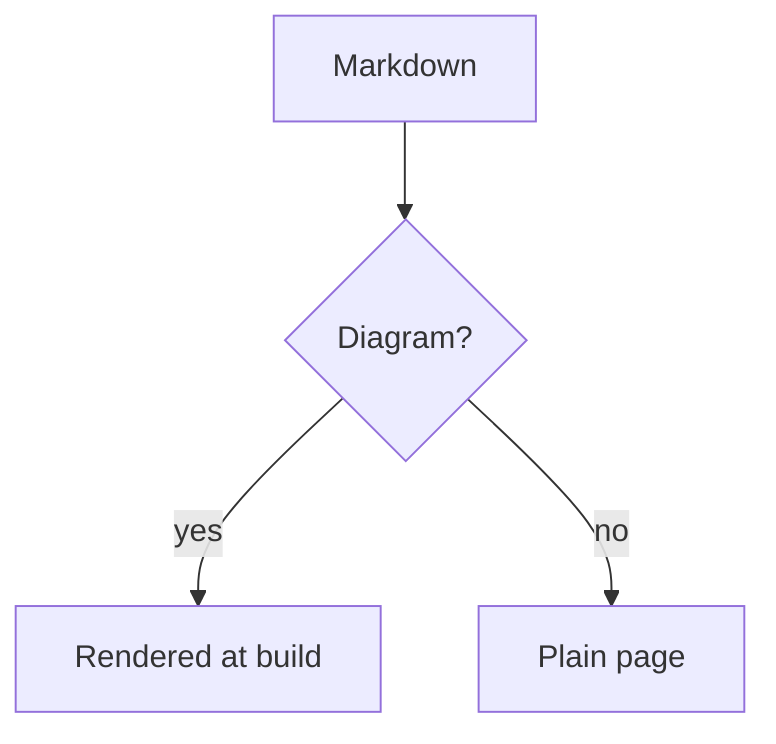

---
tags:
  - markdown
title: Code Blocks
description: Syntax highlighting and code examples in eziwiki
order: 3
---

# Code Blocks

eziwiki uses Shiki for beautiful syntax highlighting with support for 100+ languages.

## Diagrams

A fence tagged `mermaid` is drawn during the build and arrives as an SVG:

````markdown

````


Nothing is drawn in the browser. The usual approach ships Mermaid to the reader
and lets it draw after load, which would be the largest thing this site
downloads, would move the page as the diagram appeared, and would leave a
crawler — or anyone without JavaScript — looking at nothing. Drawn once at
build time, the diagram is simply markup.

Colours come from the stylesheet rather than the diagram, so it follows dark
mode like everything else, and no web font is fetched from anywhere.

`flowchart`, `sequenceDiagram`, `stateDiagram-v2`, `classDiagram` and
`erDiagram` are drawn. A kind that cannot be — `pie` and `gantt` among them —
stays a code block, showing its source, which is what it looked like before
diagrams were supported. A diagram never stops the build.

## Basic Code Block

Use triple backticks with a language identifier:

````markdown
```javascript
function greet(name) {
  return `Hello, ${name}!`;
}
```
````

```javascript
function greet(name) {
  return `Hello, ${name}!`;
}
```

## Naming the file

An example usually comes from somewhere. `title=` puts that somewhere in the
bar, in place of the language — which a filename already implies:

````markdown
```typescript title="lib/greet.ts"
export function greet(name: string) {
  return `Hello, ${name}!`;
}
```
````

```typescript title="lib/greet.ts"
export function greet(name: string) {
  return `Hello, ${name}!`;
}
```

`file=` does the same, so a document written for another generator keeps its
labels.

## Marking lines

An example is usually longer than the part of it being discussed. Naming the
lines in braces saves the reader counting:

````markdown
```typescript {3-4}
export function greet(name: string) {
  const trimmed = name.trim();
  if (!trimmed) return 'Hello, stranger!';
  return `Hello, ${trimmed}!`;
}
```
````

```typescript {3-4}
export function greet(name: string) {
  const trimmed = name.trim();
  if (!trimmed) return 'Hello, stranger!';
  return `Hello, ${trimmed}!`;
}
```

Single lines and ranges both work, in any combination: `{1}`, `{2,5}`,
`{1,4-6}`. Marked lines keep their own colours and take a background, so the
emphasis reads as emphasis rather than as some other kind of code.

## Numbering lines

`showLineNumbers` runs a gutter down the left:

````markdown
```bash showLineNumbers
npm install
npm run dev
npm run build
```
````

```bash showLineNumbers
npm install
npm run dev
npm run build
```

The numbers come from a CSS counter rather than from the markup, so they are
not part of the code: copying the block, or selecting it by hand, gives the
commands without the numbers in front of them.

All three annotations can share one fence, in any order:

````markdown
```typescript title="lib/greet.ts" {2} showLineNumbers
export function greet(name: string) {
  return `Hello, ${name}!`;
}
```
````

```typescript title="lib/greet.ts" {2} showLineNumbers
export function greet(name: string) {
  return `Hello, ${name}!`;
}
```

An annotation meant for some other tool is ignored rather than rejected, so a
document written elsewhere still renders as the code it is.

## Supported Languages

### JavaScript / TypeScript

````markdown
```typescript
interface User {
  name: string;
  email: string;
  role: 'admin' | 'user';
}

function greetUser(user: User): string {
  return `Hello, ${user.name}!`;
}
```
````

```typescript
interface User {
  name: string;
  email: string;
  role: 'admin' | 'user';
}

function greetUser(user: User): string {
  return `Hello, ${user.name}!`;
}
```

### Python

````markdown
```python
def calculate_fibonacci(n: int) -> list[int]:
    """Generate Fibonacci sequence."""
    if n <= 0:
        return []
    elif n == 1:
        return [0]

    fib = [0, 1]
    for i in range(2, n):
        fib.append(fib[i-1] + fib[i-2])

    return fib
```
````

```python
def calculate_fibonacci(n: int) -> list[int]:
    """Generate Fibonacci sequence."""
    if n <= 0:
        return []
    elif n == 1:
        return [0]

    fib = [0, 1]
    for i in range(2, n):
        fib.append(fib[i-1] + fib[i-2])

    return fib
```

### Bash / Shell

````markdown
```bash
#!/bin/bash

# Install dependencies
npm install

# Start development server
npm run dev

# Build for production
npm run build
```
````

```bash
#!/bin/bash

# Install dependencies
npm install

# Start development server
npm run dev

# Build for production
npm run build
```

### JSON

````markdown
```json
{
  "name": "eziwiki",
  "version": "1.0.0",
  "scripts": {
    "dev": "next dev",
    "build": "next build"
  }
}
```
````

```json
{
  "name": "eziwiki",
  "version": "1.0.0",
  "scripts": {
    "dev": "next dev",
    "build": "next build"
  }
}
```

### CSS

````markdown
```css
.container {
  max-width: 1200px;
  margin: 0 auto;
  padding: 2rem;
}

.button {
  background-color: #2563eb;
  color: white;
  padding: 0.5rem 1rem;
  border-radius: 0.375rem;
}
```
````

```css
.container {
  max-width: 1200px;
  margin: 0 auto;
  padding: 2rem;
}

.button {
  background-color: #2563eb;
  color: white;
  padding: 0.5rem 1rem;
  border-radius: 0.375rem;
}
```

### HTML

````markdown
```html
<!DOCTYPE html>
<html lang="en">
  <head>
    <meta charset="UTF-8" />
    <title>My Page</title>
  </head>
  <body>
    <h1>Hello, World!</h1>
  </body>
</html>
```
````

```html
<!DOCTYPE html>
<html lang="en">
  <head>
    <meta charset="UTF-8" />
    <title>My Page</title>
  </head>
  <body>
    <h1>Hello, World!</h1>
  </body>
</html>
```

### SQL

````markdown
```sql
SELECT users.name, COUNT(posts.id) as post_count
FROM users
LEFT JOIN posts ON users.id = posts.user_id
WHERE users.active = true
GROUP BY users.id
ORDER BY post_count DESC
LIMIT 10;
```
````

```sql
SELECT users.name, COUNT(posts.id) as post_count
FROM users
LEFT JOIN posts ON users.id = posts.user_id
WHERE users.active = true
GROUP BY users.id
ORDER BY post_count DESC
LIMIT 10;
```

### YAML

````markdown
```yaml
name: Deploy
on:
  push:
    branches: [main]
jobs:
  deploy:
    runs-on: ubuntu-latest
    steps:
      - uses: actions/checkout@v2
      - name: Build
        run: npm run build
```
````

```yaml
name: Deploy
on:
  push:
    branches: [main]
jobs:
  deploy:
    runs-on: ubuntu-latest
    steps:
      - uses: actions/checkout@v2
      - name: Build
        run: npm run build
```

## More Languages

eziwiki supports 100+ languages including:

- `javascript`, `typescript`, `jsx`, `tsx`
- `python`, `java`, `c`, `cpp`, `csharp`, `go`, `rust`
- `html`, `css`, `scss`, `sass`, `less`
- `json`, `yaml`, `toml`, `xml`
- `bash`, `shell`, `powershell`
- `sql`, `graphql`
- `markdown`, `mdx`
- `dockerfile`, `nginx`
- `php`, `ruby`, `perl`, `lua`
- And many more!

## Inline Code

Use single backticks for inline code:

```markdown
Use `const` instead of `var` in JavaScript.
```

Use `const` instead of `var` in JavaScript.

## Code Without Highlighting

Use `text` or omit the language:

````markdown
```text
Plain text without syntax highlighting
```
````

```text
Plain text without syntax highlighting
```

## Best Practices

### Always Specify Language

````markdown
✅ Good:

```javascript
const x = 10;
```

❌ Bad:

```
const x = 10;
```
````

### Use Proper Indentation

````markdown
✅ Good:

```javascript
function example() {
  if (true) {
    console.log('Properly indented');
  }
}
```

❌ Bad:

```javascript
function example() {
  if (true) {
    console.log('Bad indentation');
  }
}
```
````

### Add Comments for Clarity

````markdown
```javascript
// Initialize user data
const user = {
  name: 'Alice',
  email: 'alice@example.com',
};

// Send welcome email
sendEmail(user.email, 'Welcome!');
```
````

### Keep Examples Focused

````markdown
✅ Good - focused example:

```javascript
// Calculate total price
const total = items.reduce((sum, item) => sum + item.price, 0);
```

❌ Bad - too much code:

```javascript
// 100 lines of unrelated code...
```
````

## Escaping Code Blocks

To show code blocks in Markdown (like this guide does), use 4 backticks:

`````markdown
````markdown
```javascript
const x = 10;
```
````
`````

## Dark Mode Support

Code blocks automatically adapt to light and dark themes. The syntax highlighting theme changes based on the user's preference.

## Next Steps

- [Learn Markdown Basics](/content/markdown-basics)
- [Add Frontmatter](/content/frontmatter)
- [Create Your First Wiki](/getting-started/first-wiki)
