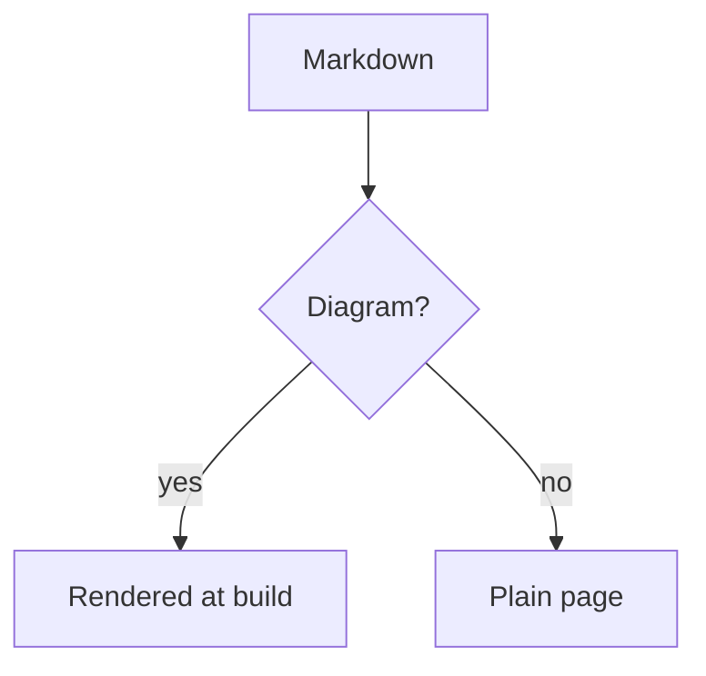

---
tags:
  - markdown
title: 代码块
description: eziwiki 中的语法高亮与代码示例
order: 3
---

# 代码块

eziwiki 使用 Shiki 提供精美的语法高亮，支持 100 多种语言。

## 图表

标记为 `mermaid` 的围栏代码块会在构建时被绘制，并以 SVG 的形式呈现：

````markdown

````


浏览器中不会进行任何绘制。常规做法是把 Mermaid 随页面发送给读者，待页面加载后再绘制，但这会成为本站下载量最大的资源，图表出现时还会让页面发生位移，并且爬虫——以及任何没有启用 JavaScript 的访客——将什么也看不到。在构建时绘制一次，图表就只是普通的标记（markup）而已。

颜色来自样式表而不是图表本身，因此它会像其他所有内容一样跟随深色模式，并且不会从任何地方获取网络字体。

`flowchart`、`sequenceDiagram`、`stateDiagram-v2`、`classDiagram` 和 `erDiagram` 都会被绘制。无法绘制的类型——其中包括 `pie` 和 `gantt`——会保持为代码块并显示其源码，这正是图表功能出现之前的样子。图表永远不会中断构建。

## 基本代码块

使用带语言标识的三重反引号：

````markdown
```javascript
function greet(name) {
  return `Hello, ${name}!`;
}
```
````

```javascript
function greet(name) {
  return `Hello, ${name}!`;
}
```

## 为文件命名

示例通常来自某个具体文件。`title=` 会把这个出处显示在标题栏中，取代语言名称——而文件名本身已经隐含了这一点：

````markdown
```typescript title="lib/greet.ts"
export function greet(name: string) {
  return `Hello, ${name}!`;
}
```
````

```typescript title="lib/greet.ts"
export function greet(name: string) {
  return `Hello, ${name}!`;
}
```

`file=` 的作用相同，因此为其他生成器编写的文档可以保留原有的标签。

## 标记行

示例通常比所讨论的部分更长。用花括号标出具体的行，读者就不必自己数了：

````markdown
```typescript {3-4}
export function greet(name: string) {
  const trimmed = name.trim();
  if (!trimmed) return 'Hello, stranger!';
  return `Hello, ${trimmed}!`;
}
```
````

```typescript {3-4}
export function greet(name: string) {
  const trimmed = name.trim();
  if (!trimmed) return 'Hello, stranger!';
  return `Hello, ${trimmed}!`;
}
```

单行和区间都可以，并且可以任意组合：`{1}`、`{2,5}`、`{1,4-6}`。被标记的行保留自己的颜色并带有背景，因此强调读起来就是强调，而不是另一种代码。

## 显示行号

`showLineNumbers` 会在左侧显示行号栏：

````markdown
```bash showLineNumbers
npm install
npm run dev
npm run build
```
````

```bash showLineNumbers
npm install
npm run dev
npm run build
```

行号来自 CSS 计数器而不是标记，因此它们不属于代码：复制代码块或手动选择时，得到的命令不会带有前面的行号。

三种注解可以共用一个围栏代码块，顺序任意：

````markdown
```typescript title="lib/greet.ts" {2} showLineNumbers
export function greet(name: string) {
  return `Hello, ${name}!`;
}
```
````

```typescript title="lib/greet.ts" {2} showLineNumbers
export function greet(name: string) {
  return `Hello, ${name}!`;
}
```

为其他工具准备的注解会被忽略而不是被拒绝，因此在别处编写的文档仍然会以其本来的代码形式渲染。

## 超出页面的长行

代码不是散文，不会自动换行：比代码块更宽的行会改为横向滚动，这样缩进得以保留，一行始终是一行。

在窄屏幕上，代码会直接停在边缘，因为手机只有在滚动时才会显示滚动条。取而代之的是，边缘会被加上阴影，阴影位于代码超出较多的一侧，当你滚动到那一端时阴影消失。能够完整容纳的代码块不会显示任何阴影。整个效果由四个背景渐变实现——没有脚本，也不向标记中添加任何内容。

## 支持的语言

### JavaScript / TypeScript

````markdown
```typescript
interface User {
  name: string;
  email: string;
  role: 'admin' | 'user';
}

function greetUser(user: User): string {
  return `Hello, ${user.name}!`;
}
```
````

```typescript
interface User {
  name: string;
  email: string;
  role: 'admin' | 'user';
}

function greetUser(user: User): string {
  return `Hello, ${user.name}!`;
}
```

### Python

````markdown
```python
def calculate_fibonacci(n: int) -> list[int]:
    """生成斐波那契数列。"""
    if n <= 0:
        return []
    elif n == 1:
        return [0]

    fib = [0, 1]
    for i in range(2, n):
        fib.append(fib[i-1] + fib[i-2])

    return fib
```
````

```python
def calculate_fibonacci(n: int) -> list[int]:
    """生成斐波那契数列。"""
    if n <= 0:
        return []
    elif n == 1:
        return [0]

    fib = [0, 1]
    for i in range(2, n):
        fib.append(fib[i-1] + fib[i-2])

    return fib
```

### Bash / Shell

````markdown
```bash
#!/bin/bash

# 安装依赖
npm install

# 启动开发服务器
npm run dev

# 构建生产版本
npm run build
```
````

```bash
#!/bin/bash

# 安装依赖
npm install

# 启动开发服务器
npm run dev

# 构建生产版本
npm run build
```

### JSON

````markdown
```json
{
  "name": "eziwiki",
  "version": "1.0.0",
  "scripts": {
    "dev": "next dev",
    "build": "next build"
  }
}
```
````

```json
{
  "name": "eziwiki",
  "version": "1.0.0",
  "scripts": {
    "dev": "next dev",
    "build": "next build"
  }
}
```

### CSS

````markdown
```css
.container {
  max-width: 1200px;
  margin: 0 auto;
  padding: 2rem;
}

.button {
  background-color: #2563eb;
  color: white;
  padding: 0.5rem 1rem;
  border-radius: 0.375rem;
}
```
````

```css
.container {
  max-width: 1200px;
  margin: 0 auto;
  padding: 2rem;
}

.button {
  background-color: #2563eb;
  color: white;
  padding: 0.5rem 1rem;
  border-radius: 0.375rem;
}
```

### HTML

````markdown
```html
<!DOCTYPE html>
<html lang="en">
  <head>
    <meta charset="UTF-8" />
    <title>My Page</title>
  </head>
  <body>
    <h1>Hello, World!</h1>
  </body>
</html>
```
````

```html
<!DOCTYPE html>
<html lang="en">
  <head>
    <meta charset="UTF-8" />
    <title>My Page</title>
  </head>
  <body>
    <h1>Hello, World!</h1>
  </body>
</html>
```

### SQL

````markdown
```sql
SELECT users.name, COUNT(posts.id) as post_count
FROM users
LEFT JOIN posts ON users.id = posts.user_id
WHERE users.active = true
GROUP BY users.id
ORDER BY post_count DESC
LIMIT 10;
```
````

```sql
SELECT users.name, COUNT(posts.id) as post_count
FROM users
LEFT JOIN posts ON users.id = posts.user_id
WHERE users.active = true
GROUP BY users.id
ORDER BY post_count DESC
LIMIT 10;
```

### YAML

````markdown
```yaml
name: Deploy
on:
  push:
    branches: [main]
jobs:
  deploy:
    runs-on: ubuntu-latest
    steps:
      - uses: actions/checkout@v2
      - name: Build
        run: npm run build
```
````

```yaml
name: Deploy
on:
  push:
    branches: [main]
jobs:
  deploy:
    runs-on: ubuntu-latest
    steps:
      - uses: actions/checkout@v2
      - name: Build
        run: npm run build
```

## 更多语言

eziwiki 支持 100 多种语言，包括：

- `javascript`, `typescript`, `jsx`, `tsx`
- `python`, `java`, `c`, `cpp`, `csharp`, `go`, `rust`
- `html`, `css`, `scss`, `sass`, `less`
- `json`, `yaml`, `toml`, `xml`
- `bash`, `shell`, `powershell`
- `sql`, `graphql`
- `markdown`, `mdx`
- `dockerfile`, `nginx`
- `php`, `ruby`, `perl`, `lua`
- 以及更多！

## 行内代码

使用单个反引号来表示行内代码：

```markdown
在 JavaScript 中使用 `const` 而不是 `var`。
```

在 JavaScript 中使用 `const` 而不是 `var`。

## 无语法高亮的代码

使用 `text`，或者省略语言标识：

````markdown
```text
没有语法高亮的纯文本
```
````

```text
没有语法高亮的纯文本
```

## 最佳实践

### 始终指定语言

````markdown
✅ 好的：

```javascript
const x = 10;
```

❌ 不好的：

```
const x = 10;
```
````

### 使用正确的缩进

````markdown
✅ 好的：

```javascript
function example() {
  if (true) {
    console.log('Properly indented');
  }
}
```

❌ 不好的：

```javascript
function example() {
  if (true) {
    console.log('Bad indentation');
  }
}
```
````

### 添加注释以提升可读性

````markdown
```javascript
// 初始化用户数据
const user = {
  name: 'Alice',
  email: 'alice@example.com',
};

// 发送欢迎邮件
sendEmail(user.email, 'Welcome!');
```
````

### 保持示例聚焦

````markdown
✅ 好的 - 聚焦的示例：

```javascript
// 计算总价
const total = items.reduce((sum, item) => sum + item.price, 0);
```

❌ 不好的 - 代码过多：

```javascript
// 100 行无关的代码……
```
````

## 转义代码块

要在 Markdown 中展示代码块（就像本指南所做的那样），请使用 4 个反引号：

`````markdown
````markdown
```javascript
const x = 10;
```
````
`````

## 深色模式支持

代码块会自动适配浅色与深色主题。语法高亮主题会根据用户的偏好切换。

## 下一步

- [学习 Markdown 基础](/example/content/markdown-basics)
- [添加 Frontmatter](/example/content/frontmatter)
- [创建你的第一个 Wiki](/example/getting-started/first-wiki)
